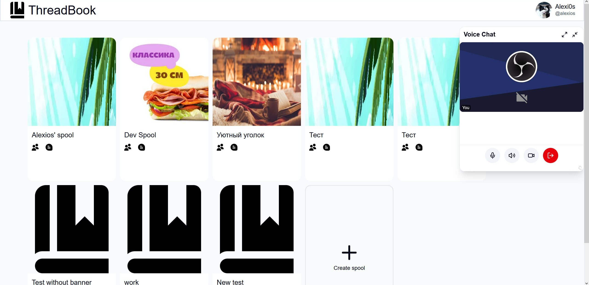
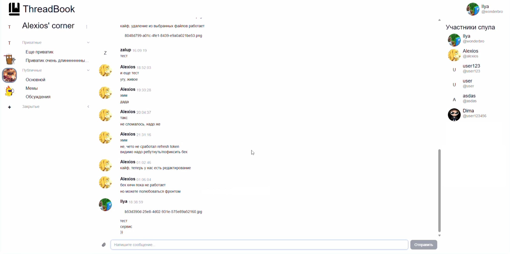
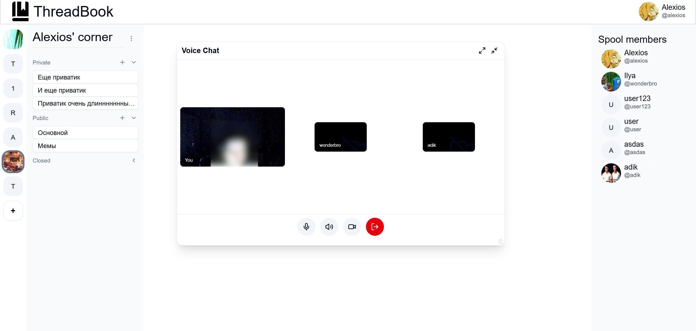

# Фронтенд проекта ThreadBook

## Авторы

- [**Александр Волощук**](https://github.com/DeveloperMan313) (основная часть)
- [**Илья Фролов**](https://github.com/Ifroloff) (UI и логика видеозвонков)

## Описание проекта

ThreadBook - платформа для общения, где пользователи могут объединяться в сообщества (spool - спул) и далее разделять дискуссию спула на ветки (thread - тред). Аналогия названий исходит от катушки, обмотанной нитью. Пользователи также могут заходить в видеозвонки, разделенные по тредам.

Фронтенд написан на SvelteKit, для real-time сообщений используется centrifuge-js.

### Особенности

- Изменения в параметрах спулов, тредов и профилей пользователей отображаются мгновенно у всех пользователей, находящихся на странице (с помощью Centrifugo + centrifuge-js)
- Временные аккаунты, которые выдаются по приглашениям пользователям, еще не желающим регистрироваться
- Возможность отправки файлов в тредах
- Интерфейс адаптирован под десктопные и мобильные устройства
- Локализация UI: английский и русский языки

### Возможности

- Создание спула, настройка его названия и баннера
- Создание треда (публичного или приватного)
- Редактирование спула, приглашение в него участников
- Редактирование треда, приглашение в приватный тред участников
- Закрытие треда (уходит в архив, больше нельзя отправлять сообщения)
- Редактирование профиля пользователя
- Отправка сообщений и файлов в треды
- Редактирование и удаление своих сообщений
- Вход в видеозвонок треда, управление активностью микрофона, динамика и камеры

## Скриншоты

Список спулов, в которых состоит пользователь, и видеозвонок



Тред с сообщениями и файлами



Видеозвонок



## Запуск в режиме разработки

Чтобы запустить dev сервер:

```sh
npm run dev

# или запустить сервер и открыть приложение в новой вкладке браузера
npm run dev -- --open
```

## Сборка

Чтобы собрать продакшен-версию приложения:

```sh
npm run build
```

Продакшен-сборку можно просмотреть с помощью `npm run preview`.

## Ссылки:

[Бэкенд проекта](https://github.com/onionfriend2004/threadbook_backend)
